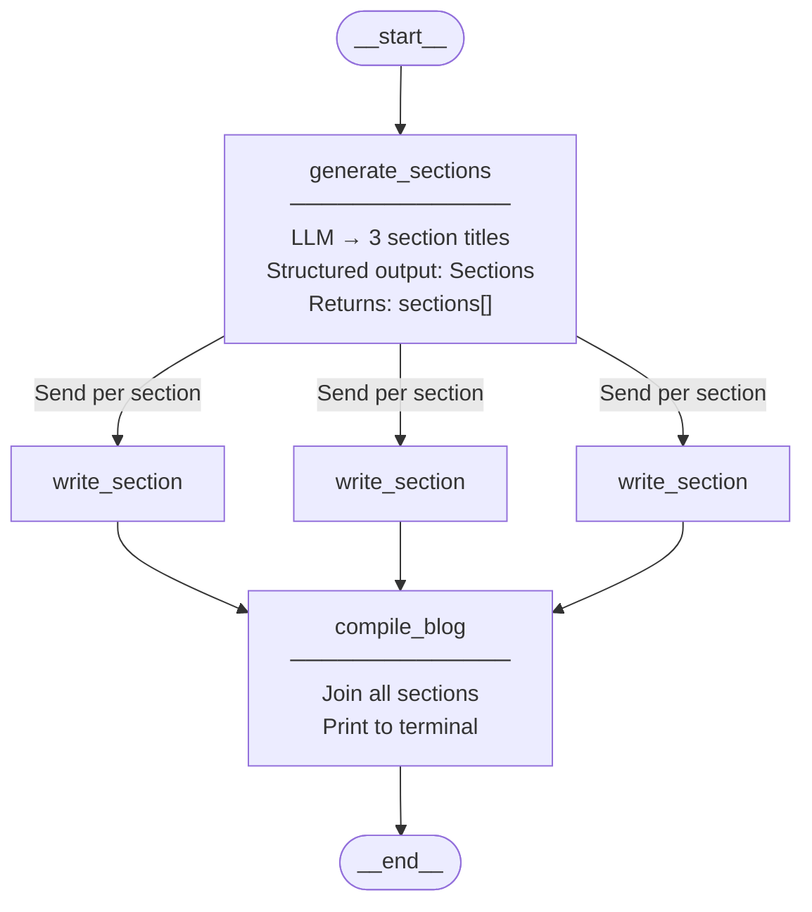
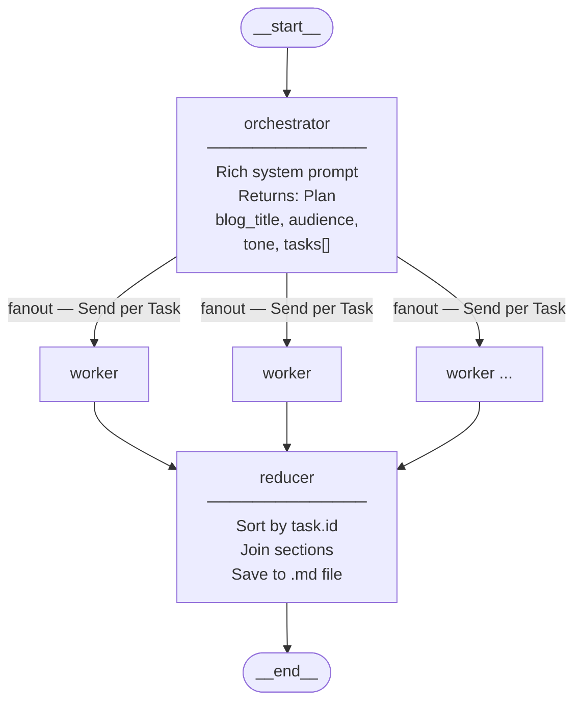
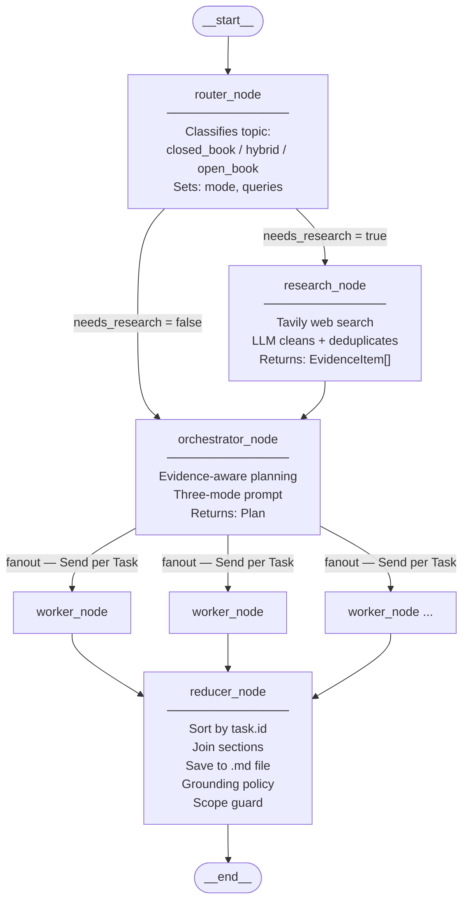
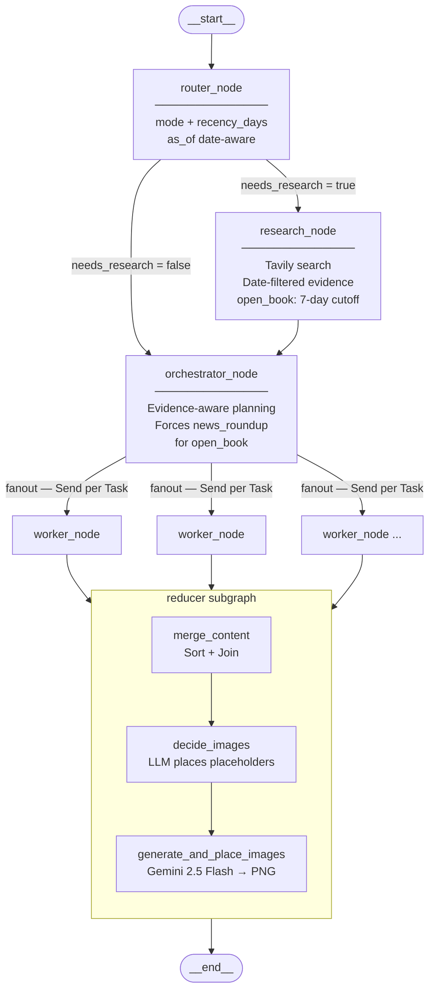
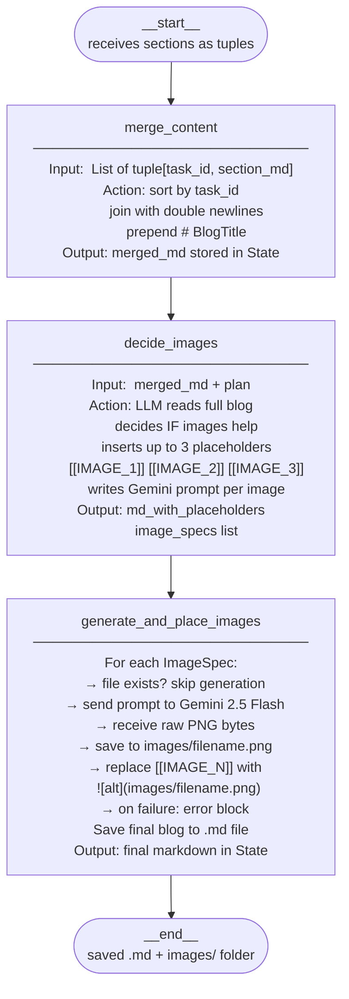
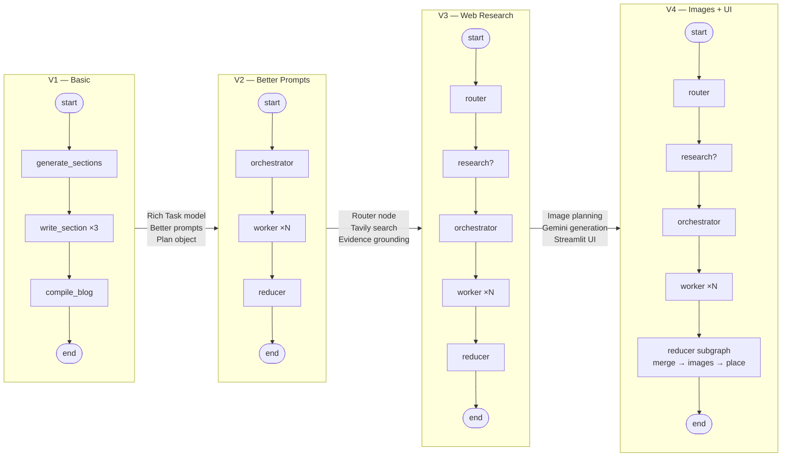

# Blog Agent Evolution — Mermaid Diagrams
# All 4 versions: individual graphs + evolution comparison + reducer subgraph

# ─────────────────────────────────────────────────────────────────────────────
# DIAGRAM 1 — V1: Basic Blog Agent
# ─────────────────────────────────────────────────────────────────────────────

# ─────────────────────────────────────────────────────────────────────────────
# DIAGRAM 2 — V2: Improved Prompting
# ─────────────────────────────────────────────────────────────────────────────

# ─────────────────────────────────────────────────────────────────────────────
# DIAGRAM 3 — V3: Research-Powered (Tavily)
# ─────────────────────────────────────────────────────────────────────────────

# ─────────────────────────────────────────────────────────────────────────────
# DIAGRAM 4 — V4: Images + Streamlit UI (Main Graph)
# ─────────────────────────────────────────────────────────────────────────────

# ─────────────────────────────────────────────────────────────────────────────
# DIAGRAM 5 — REDUCER SUBGRAPH (V4 only, detailed)
# ─────────────────────────────────────────────────────────────────────────────

# ─────────────────────────────────────────────────────────────────────────────
# DIAGRAM 6 — EVOLUTION COMPARISON (all 4 side by side)
# ─────────────────────────────────────────────────────────────────────────────

